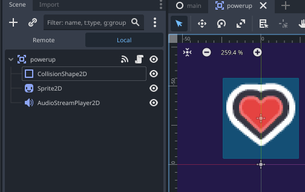

# Détection de collisions (collision detection)

La détection de collision est un mécanisme fondamental qui permet de détecter quand deux objets se rencontrent dans l'espace de jeu. Ce système est essentiel pour créer des interactions ludiques : ramasser des objets, déclencher des événements, ou gérer les limites physiques du monde virtuel.



## Comprendre les types de corps de collision

Godot propose différents types de corps physiques, chacun ayant un rôle spécifique :

### Area2D - Zones de détection
Les [Area2D](https://docs.godotengine.org/fr/4.x/classes/class_area2d.html) détectent les chevauchements sans créer de collision physique solide. Idéales pour :
- **Zones de collecte** (powerups, pièces de monnaie)
- **Déclencheurs d'événements** (portes automatiques, téléporteurs)
- **Zones d'effet** (champs de force, zones de dégâts)

### PhysicsBody2D - Corps avec collision physique
Les corps physiques créent des interactions mécaniques réelles :
- [StaticBody2D](https://docs.godotengine.org/fr/4.x/classes/class_staticbody2d.html) 
    * Objets immobiles (murs, plateformes fixes)
- [RigidBody2D](https://docs.godotengine.org/fr/4.x/classes/class_rigidbody2d.html) 
    * Physique simulée (projectiles, objets qui tombent)
- [CharacterBody2D](https://docs.godotengine.org/fr/4.x/classes/class_characterbody2d.html)
    * contrôle manuel du mouvement (personnage joueur)

## Configuration des couches de collision

Le système de couches permet un contrôle précis des interactions :

- **collision_layer** : définit sur quelles couches l'objet existe
- **collision_mask** : détermine quelles couches l'objet peut détecter

```gdscript
# Exemple : système joueur/ennemis/objets
# Couche 1 = joueur, Couche 2 = ennemis, Couche 3 = objets collectables

# Configuration du joueur
$Player.collision_layer = 1      # Existe sur couche 1
$Player.collision_mask = 6       # Détecte couches 2 et 3 (2+4=6 en binaire)

# Configuration d'un ennemi  
$Enemy.collision_layer = 2       # Existe sur couche 2
$Enemy.collision_mask = 1        # Détecte couche 1 (joueur)

# Configuration d'un objet collectable
$Powerup.collision_layer = 4     # Existe sur couche 3 (2^2=4)
$Powerup.collision_mask = 1      # Détecte couche 1 (joueur)
```

## Détection automatique avec signaux

L'Area2D émet des signaux automatiquement lors des entrées/sorties :


### Exemple basique - Powerup qui disparaît et joue un son
```gdscript
## Powerup avec son et disparition à la collecte
class_name Powerup extends Area2D


func _on_body_entered(_body: Node2D) -> void:
	hide()
	$AudioStreamPlayer2D.play()
	$CollisionShape2D.set_deferred("disabled", true)

```

## Optimisation des formes de collision

### Types de formes recommandées
- **RectangleShape2D** : idéal pour plateformes, murs
- **CircleShape2D** : parfait pour personnages ronds, projectiles
- **CapsuleShape2D** : excellent pour personnages humanoïdes
- **ConvexPolygonShape2D** : formes personnalisées optimisées

### Bonnes pratiques de performance
- Privilégiez les **formes simples** (rectangle, cercle)
- Évitez les **CollisionPolygon2D** complexes pour des objets nombreux
- Désactivez `monitoring = false` si la détection n'est pas nécessaire
- Utilisez `monitorable = false` pour les objets qui ne doivent pas être détectés
- Regroupez les objets similaires sur les **mêmes couches**


## Signaux disponibles avec Area2D

L'Area2D offre plusieurs signaux pour différents niveaux de détection :

```gdscript
extends Area2D

func _ready():
    # Signaux pour les corps physiques
    body_entered.connect(_on_body_entered)           # Corps entre dans la zone
    body_exited.connect(_on_body_exited)             # Corps quitte la zone
    body_shape_entered.connect(_on_body_shape_entered) # Forme spécifique entre
    body_shape_exited.connect(_on_body_shape_exited)   # Forme spécifique sort
    
    # Signaux pour les autres Area2D
    area_entered.connect(_on_area_entered)           # Autre Area2D entre
    area_exited.connect(_on_area_exited)             # Autre Area2D sort
    area_shape_entered.connect(_on_area_shape_entered) # Forme d'Area2D entre
    area_shape_exited.connect(_on_area_shape_exited)   # Forme d'Area2D sort

# Les signaux de forme donnent plus d'informations
func _on_body_shape_entered(body_rid: RID, body: Node2D, body_shape_index: int, local_shape_index: int):
    print("Forme ", body_shape_index, " du corps ", body.name, " a touché notre forme ", local_shape_index)
```

## Points clés à retenir

1. **Area2D** = détection sans collision physique, **PhysicsBody2D** = collision avec physique
2. Les **signaux automatiques** simplifient grandement la détection d'entrée/sortie  
3. Le **système de couches** permet un contrôle fin des interactions
4. **Toujours vérifier** le type/groupe de l'objet détecté pour éviter les erreurs
5. **Optimiser** avec des formes simples et une gestion intelligente des couches
6. **Désactiver la collision** après collecte pour éviter les détections multiples

## Ressources pour approfondir

- [Introduction à la physique - Documentation Godot](https://docs.godotengine.org/fr/4.x/tutorials/physics/physics_introduction.html)
- [Utiliser les Area2D - Documentation Godot](https://docs.godotengine.org/fr/4.x/tutorials/physics/using_area_2d.html)  
- [CollisionShape2D - Référence API](https://docs.godotengine.org/fr/stable/classes/class_collisionshape2d.html)
- [Area2D - Référence API](https://docs.godotengine.org/fr/stable/classes/class_area2d.html)

