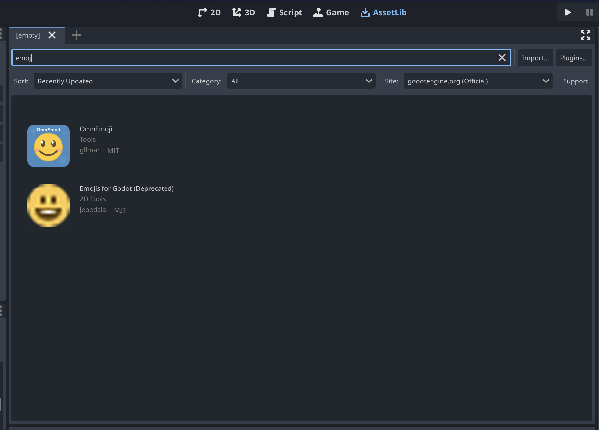
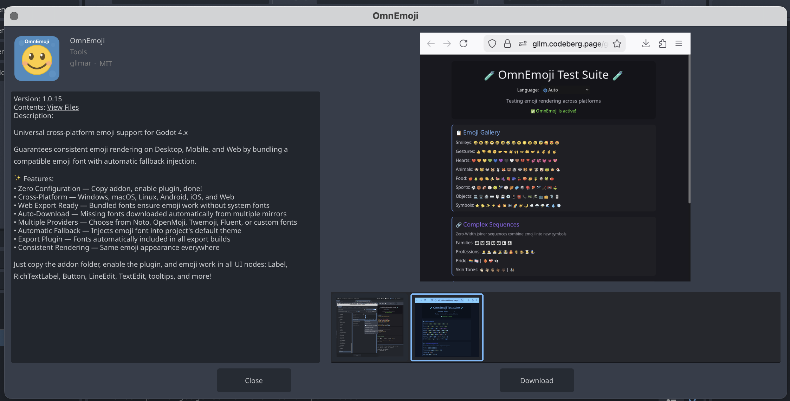
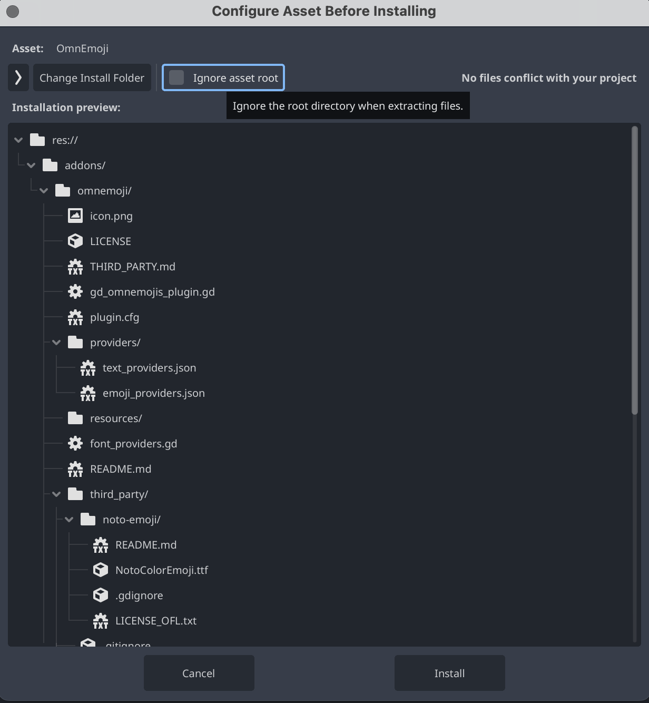
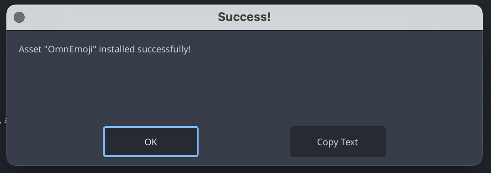
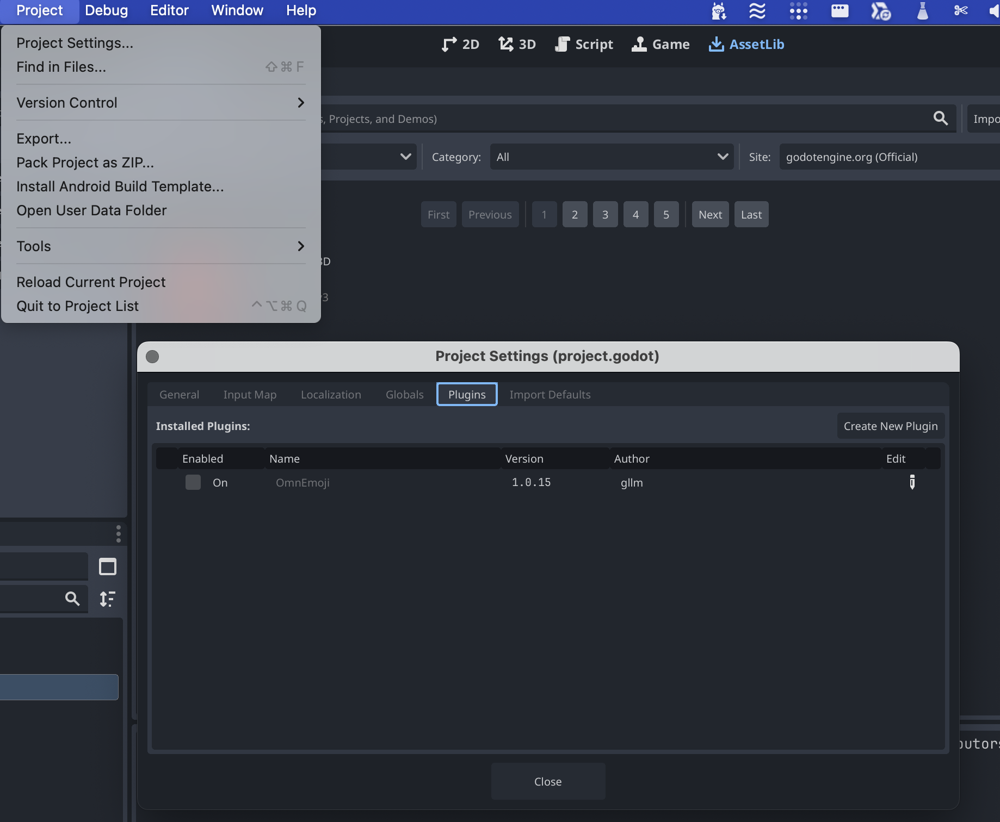
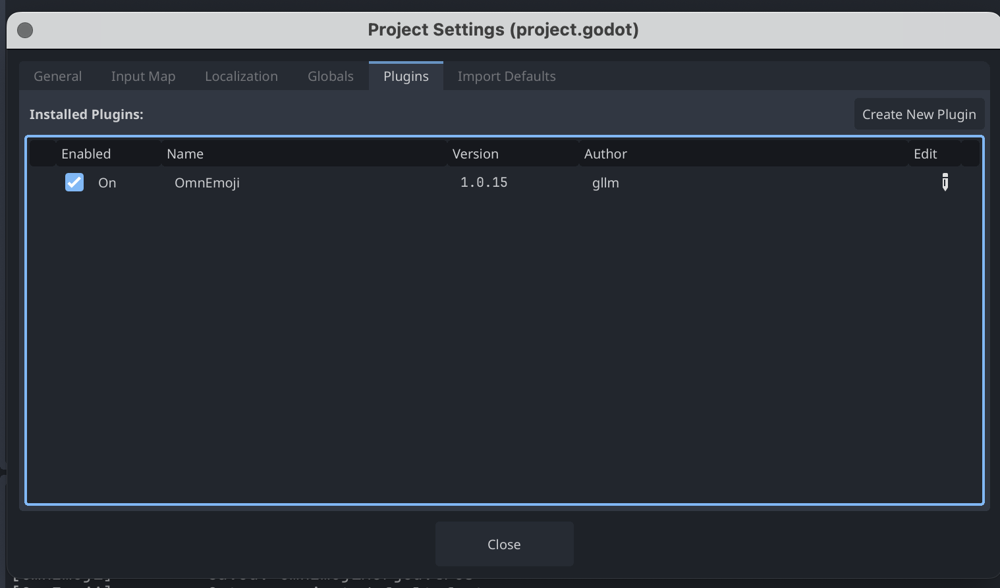

# Godot + Addons 

## Support pour les Emoji dans l'export web

Par default, Godot utilise une police (font) fournie par le système d'opération. Dans certains cas, particulière pour l'export Web, les Emoji n'apparaissent pas.   

### OmnEmoji

* 

* 

* 

* 

* 

* 


Lorsque le plugin s'active pour la première fois vous devriez voir le message suivant dans la console 

```
Godot Engine v4.5.1.stable.official (c) 2007-present Juan Linietsky, Ariel Manzur & Godot Contributors.
--- Debug adapter server started on port 6006 ---
--- GDScript language server started on port 6005 ---
[OmnEmoji] Created emoji font resource: res://addons/omnemoji/resources/.cache/OmnEmojiFont.tres
[OmnEmoji] Created text font resource: res://addons/omnemoji/resources/.cache/OmnTextFont.tres
[OmnEmoji] ━━━━━━━━━━━━━━━━━━━━━━━━━━━━━━━━━━━━━━━━
[OmnEmoji] 📦 BUNDLING FONTS
[OmnEmoji] ━━━━━━━━━━━━━━━━━━━━━━━━━━━━━━━━━━━━━━━━
[OmnEmoji]   Emoji: Noto Color Emoji (CBDT/CBLC)
[OmnEmoji]   Text:  Noto Sans
[OmnEmoji] ━━━━━━━━━━━━━━━━━━━━━━━━━━━━━━━━━━━━━━━━
[OmnEmoji] [1/4] Loading emoji font...
[OmnEmoji]       ✓ Loaded: NotoColorEmoji.ttf
[OmnEmoji] [2/4] Loading text font...
[OmnEmoji]       ✓ Loaded: NotoSans-Regular.ttf
[OmnEmoji] [3/4] Building merged font resource...
[OmnEmoji]       ✓ Using Noto Sans as base font
[OmnEmoji]       ✓ Added Noto Color Emoji as emoji fallback
[OmnEmoji] [4/4] Saving bundled resources...
[OmnEmoji]       ✓ Saved: OmnTextFont.tres
[OmnEmoji]       ✓ Saved: OmnEmojiMerged.tres
[OmnEmoji]       ✓ Set as project default font
[OmnEmoji] ━━━━━━━━━━━━━━━━━━━━━━━━━━━━━━━━━━━━━━━━
[OmnEmoji] ✓ BUNDLING COMPLETE
[OmnEmoji] ━━━━━━━━━━━━━━━━━━━━━━━━━━━━━━━━━━━━━━━━
[OmnEmoji] Export plugin registered - fonts will be bundled in all exports.

```

Si jamais cela ne fonctionne pas procédez à une installation manuel

téléchargement de la version la plus récente

https://codeberg.org/gllm/gd-OmnEmoji/releases

puis mettre dans un dossier addons dans la racine de votre projet, 
activez le plugins via Project Settings / Addon 